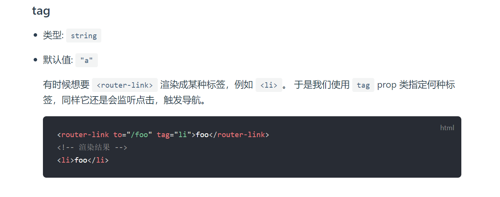
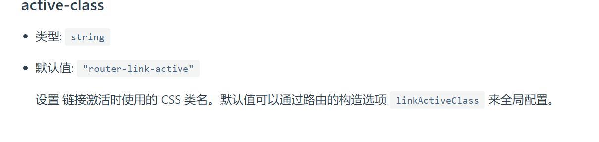
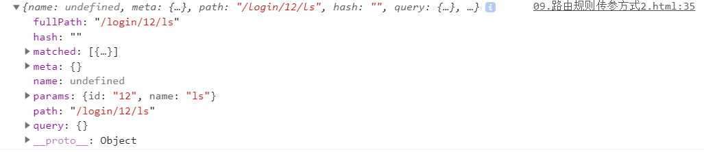
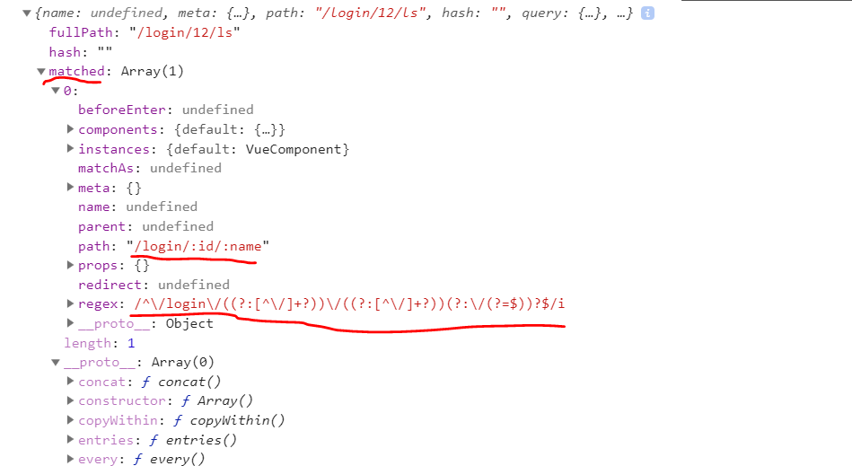

## 什么是路由

1. **后端路由：**对于普通的网站，所有的超链接都是URL地址，所有的URL地址都对应服务器上对应的资源；
2. **前端路由：**对于单页面应用程序来说，主要通过URL中的hash(#号)来实现不同页面之间的切换，同时，hash有一个特点：HTTP请求中不会包含hash相关的内容；所以，单页面程序中的页面跳转主要用hash实现；
3. 在单页面应用程序中，这种通过hash改变来切换页面的方式，称作前端路由（区别于后端路由）；

## 在 vue 中使用 vue-router

<https://router.vuejs.org/zh/api/#router-link-props>

1. 导入 vue-router 组件类库：

```html
<!-- 1. 导入 vue-router 组件类库 -->
  <script src="./lib/vue-router-2.7.0.js"></script>
```

1. 使用 router-link 组件来导航

```html
<!-- 2. 使用 router-link 组件来导航 -->
<router-link to="/login" tag="span">登录</router-link>
<router-link to="/register">注册</router-link>
```

1. 使用 router-view 组件来显示匹配到的组件

```html
<!-- 3. 使用 router-view 组件来显示匹配到的组件 -->
<router-view></router-view>
```

1. 创建使用`Vue.extend`创建组件

```js
    // 4.1 使用 Vue.extend 来创建登录组件
    var login = Vue.extend({
      template: '<h1>登录组件</h1>'
    });

    // 4.2 使用 Vue.extend 来创建注册组件
    var register = Vue.extend({
      template: '<h1>注册组件</h1>'
    });
```

1. 创建一个路由 router 实例，通过 routers 属性来定义路由匹配规则

```js
// 5. 创建一个路由 router 实例，通过 routers 属性来定义路由匹配规则
    var router = new VueRouter({
      routes: [
        { path: '/login', component: login },
        { path: '/register', component: register }
      ]
    });
```

1. 使用 router 属性来使用路由规则

```
// 6. 创建 Vue 实例，得到 ViewModel
    var vm = new Vue({
      el: '#app',
      router: router // 使用 router 属性来使用路由规则
    });
```

## 使用tag属性指定router-link渲染的标签类型



```html
	<!-- router-link 默认渲染为一个a 标签 -->
    <router-link to="/login" tag="span">登录</router-link>
    <router-link to="/register">注册</router-link>
```


## 设置路由重定向

```js
routes:[
     { path: '/', redirect: '/login' }, 
]
```

## 设置路由高亮

两种方式:默认 router-link-active 与 使用  linkActiveClass

```
 linkActiveClass: 'myactive'
```

注意：与router同级

```html 
<style>
    .router-link-active,
    .myactive {
      color: red;
      font-weight: 800;
      font-style: italic;
      font-size: 80px;
      text-decoration: underline;
      background-color: green;
    }
    </style>
```


## 设置路由切换动效

```html
<style>
.v-enter,
    .v-leave-to {
      opacity: 0;
      transform: translateX(140px);
    }

    .v-enter-active,
    .v-leave-active {
      transition: all 0.5s ease;
    }
  </style>
```


## 在路由规则中定义参数

1. 在规则中定义参数：

```js
{ path: '/register/:id', component: register }
```

```
 routes: [

        { path: '/login/:id/:name', component: login },

       { path: '/register', component: register }

      ]
```

1. 通过 `this.$route.params`来获取路由中的参数：

```js
var register = Vue.extend({
      template: '<h1>注册组件 --- {{this.$route.params.id}}</h1>'
    });
```





## 使用 `children` 属性实现路由嵌套

```html
  <div id="app">
    <router-link to="/account">Account</router-link>

    <router-view></router-view>
  </div>

  <script>
    // 父路由中的组件
    const account = Vue.extend({
      template: `<div>
        这是account组件
        <router-link to="/account/login">login</router-link> | 
        <router-link to="/account/register">register</router-link>
        <router-view></router-view>
      </div>`
    });

    // 子路由中的 login 组件
    const login = Vue.extend({
      template: '<div>登录组件</div>'
    });

    // 子路由中的 register 组件
    const register = Vue.extend({
      template: '<div>注册组件</div>'
    });

    // 路由实例
    var router = new VueRouter({
      routes: [
        { path: '/', redirect: '/account/login' }, // 使用 redirect 实现路由重定向
        {
          path: '/account',
          component: account,
          children: [ // 通过 children 数组属性，来实现路由的嵌套
            { path: 'login', component: login }, // 注意，子路由的开头位置，不要加 / 路径符
            { path: 'register', component: register }
          ]
        }
      ]
    });

    // 创建 Vue 实例，得到 ViewModel
    var vm = new Vue({
      el: '#app',
      data: {},
      methods: {},
      components: {
        account
      },
      router: router
    });
  </script>
```

## 命名视图实现经典布局

1. 标签代码结构：

```html
<div id="app">
    <router-view></router-view>
    <div class="content">
      <router-view name="a"></router-view>
      <router-view name="b"></router-view>
    </div>
  </div>
```

1. JS代码：

```js
<script>
    var header = Vue.component('header', {
      template: '<div class="header">header</div>'
    });

    var sidebar = Vue.component('sidebar', {
      template: '<div class="sidebar">sidebar</div>'
    });

    var mainbox = Vue.component('mainbox', {
      template: '<div class="mainbox">mainbox</div>'
    });

    // 创建路由对象
    var router = new VueRouter({
      routes: [
        {
          path: '/', components: {
            default: header,
            a: sidebar,
            b: mainbox
          }
        }
      ]
    });

    // 创建 Vue 实例，得到 ViewModel
    var vm = new Vue({
      el: '#app',
      data: {},
      methods: {},
      router
    });
  </script>
```

1. CSS 样式：

```html
  <style>
    .header {
      border: 1px solid red;
    }

    .content{
      display: flex;
    }
    .sidebar {
      flex: 2;
      border: 1px solid green;
      height: 500px;
    }
    .mainbox{
      flex: 8;
      border: 1px solid blue;
      height: 500px;
    }
  </style>
```

## `watch`属性的使用

考虑一个问题：想要实现 `名` 和 `姓` 两个文本框的内容改变，则全名的文本框中的值也跟着改变； 

1. 监听`data`中属性的改变：--(watch)

```html
<div id="app">
    <input type="text" v-model="firstName"> +
    <input type="text" v-model="lastName"> =
    <span>{{fullName}}</span>
  </div>

  <script>
    // 创建 Vue 实例，得到 ViewModel
    var vm = new Vue({
      el: '#app',
      data: {
        firstName: 'jack',
        lastName: 'chen',
        fullName: 'jack - chen'
      },
      methods: {},
      watch: {
        'firstName': function (newVal, oldVal) { // 第一个参数是新数据，第二个参数是旧数据
          this.fullName = newVal + ' - ' + this.lastName;
        },
        'lastName': function (newVal, oldVal) {
          this.fullName = this.firstName + ' - ' + newVal;
        }
      }
    });
  </script>
```

2. 使用keyup事件--(methods)

```html
<div id="app">

    <input type="text" v-model="firstname" @keyup="getFullname"> +
    <input type="text" v-model="lastname" @keyup="getFullname"> =
    <input type="text" v-model="fullname">

  </div>

  <script>
    // 创建 Vue 实例，得到 ViewModel
    var vm = new Vue({
      el: '#app',
      data: {
        firstname: '',
        lastname: '',
        fullname: ''
      },
      methods: {
        getFullname() {
          this.fullname = this.firstname + '-' + this.lastname
        }
      }
    });
  </script>
```


3. 监听路由对象的改变：

- 使用watch 属性，可以监视 data 中指定数据的变化，然后触发这个 watch 中对应的 function 处理函数

```html
<div id="app">
    <router-link to="/login">登录</router-link>
    <router-link to="/register">注册</router-link>

    <router-view></router-view>
  </div>

  <script>
    var login = Vue.extend({
      template: '<h1>登录组件</h1>'
    });

    var register = Vue.extend({
      template: '<h1>注册组件</h1>'
    });

    var router = new VueRouter({
      routes: [
        { path: "/login", component: login },
        { path: "/register", component: register }
      ]
    });

    // 创建 Vue 实例，得到 ViewModel
    var vm = new Vue({
      el: '#app',
      data: {},
      methods: {},
      router: router,
      watch: {
        '$route': function (newVal, oldVal) {
          if (newVal.path === '/login') {
            console.log('这是登录组件');
          }
        }
      }
    });
  </script>
```

## `computed`计算属性的使用

在 computed 中，可以定义一些 属性，这些属性，叫做 【计算属性】， 计算属性的，本质，就是 一个方法，

只不过，我们在使用 这些计算属性的时候，是把 它们的 名称，直接当作 属性来使用的；

并不会把 计算属性，当作方法去调用；

- 注意1： 计算属性，在引用的时候，一定不要加 () 去调用，直接把它 当作 普通 属性去使用就好了；
- 注意2： 只要 计算属性，这个 function 内部，所用到的 任何 data 中的数据发送了变化，就会 立即重新计算 这个 计算属性的值
- 注意3： 计算属性的求值结果，会被缓存起来，方便下次直接使用； 如
- 如果 计算属性方法中，所以来的任何数据，都没有发生过变化，则，不会重新对 计算属性求值；


1. 默认只有`getter`的计算属性：--(computed)

```html
<div id="app">
    <input type="text" v-model="firstName"> +
    <input type="text" v-model="lastName"> =
    <span>{{fullName}}</span>
  </div>

  <script>
    // 创建 Vue 实例，得到 ViewModel
    var vm = new Vue({
      el: '#app',
      data: {
        firstName: 'jack',
        lastName: 'chen'
      },
      methods: {},
      computed: { // 计算属性； 特点：当计算属性中所以来的任何一个 data 属性改变之后，都会重新触发 本计算属性 的重新计算，从而更新 fullName 的值
        fullName() {
          return this.firstName + ' - ' + this.lastName;
        }
      }
    });
  </script>
```

1. 定义有`getter`和`setter`的计算属性：

```html
<div id="app">
    <input type="text" v-model="firstName">
    <input type="text" v-model="lastName">
    <!-- 点击按钮重新为 计算属性 fullName 赋值 -->
    <input type="button" value="修改fullName" @click="changeName">

    <span>{{fullName}}</span>
  </div>

  <script>
    // 创建 Vue 实例，得到 ViewModel
    var vm = new Vue({
      el: '#app',
      data: {
        firstName: 'jack',
        lastName: 'chen'
      },
      methods: {
        changeName() {
          this.fullName = 'TOM - chen2';
        }
      },
      computed: {
        fullName: {
          get: function () {
            return this.firstName + ' - ' + this.lastName;
          },
          set: function (newVal) {
            var parts = newVal.split(' - ');
            this.firstName = parts[0];
            this.lastName = parts[1];
          }
        }
      }
    });
  </script>
```

## `watch`、`computed`和`methods`之间的对比

1. `computed`属性的结果会被缓存，除非依赖的响应式属性变化才会重新计算。主要当作属性来使用；一般要return一个东西
2. `methods`方法表示一个具体的操作，主要书写大量业务逻辑；
3. `watch`一个对象，键是需要观察的表达式，值是对应回调函数。主要用来监听某些特定数据的变化，从而进行某些具体的业务逻辑操作；可以看作是`computed`和`methods`的结合体；