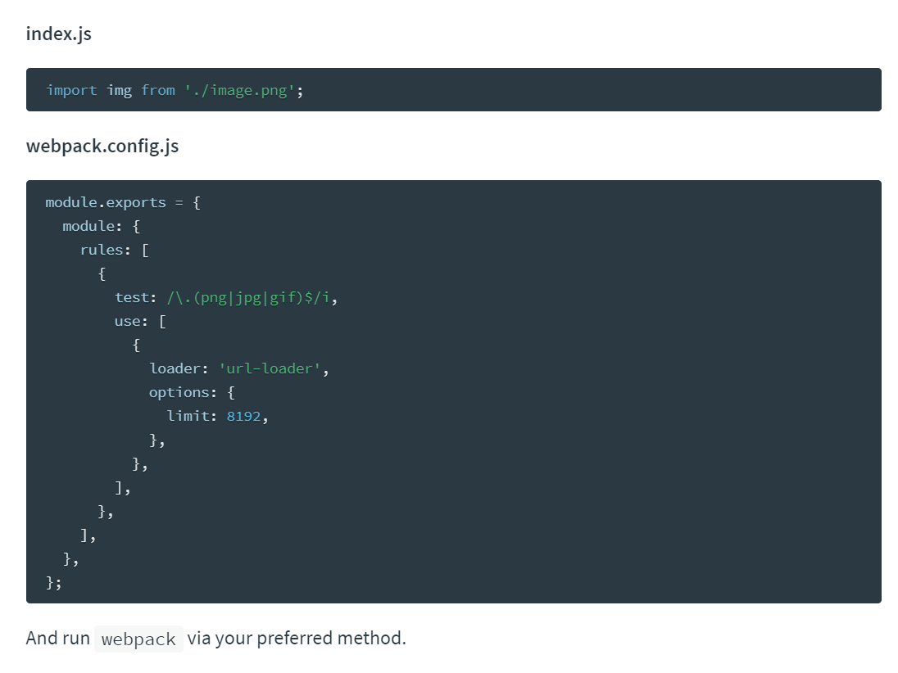

## 什么是webpack?

webpack 是前端的一个项目构建工具，它是基于 Node.js 开发出来的一个前端工具；

## 如何完美实现上述的2种解决方案

1. 使用Gulp， 是基于 task 任务的；
2. 使用Webpack， 是基于整个项目进行构建的；

- 借助于webpack这个前端自动化构建工具，可以完美实现资源的合并、打包、压缩、混淆等诸多功能。
- 根据官网的图片介绍webpack打包的过程
- [webpack官网](http://webpack.github.io/)

## webpack安装的两种方式

1. 运行`npm i webpack -g`全局安装webpack，这样就能在全局使用webpack的命令
   - 4.X 的版本对webpack-cli有要求，所以需要 全局安装webpack-cli （这是我使用的时候遇到的大坑）
   - `npm install webpack-cli -g`
2. 在项目根目录中运行`npm i webpack --save-dev`安装到项目依赖中

## 初步使用webpack打包构建列表隔行变色案例

1. 运行`npm init`初始化项目，使用npm管理项目中的依赖包
2. 创建项目基本的目录结构
3. 使用`cnpm i jquery --save`安装jquery类库
4. 创建`main.js`并书写各行变色的代码逻辑：

```js
	// 导入jquery类库
    import $ from 'jquery'

    // 设置偶数行背景色，索引从0开始，0是偶数
    $('#list li:even').css('backgroundColor','lightblue');
    // 设置奇数行背景色
    $('#list li:odd').css('backgroundColor','pink');
```

1. 直接在页面上引用`main.js`会报错，因为浏览器不认识`import`这种高级的JS语法，需要使用webpack进行处理，webpack默认会把这种高级的语法转换为低级的浏览器能识别的语法；
2. 运行`webpack 入口文件路径 输出文件路径`对`main.js`进行处理：

```shell
webpack  main.js --output-filename  bundle.js --output-pat --mode development
```

- 其中的 main.js 与 bundle.js 根据自己文件相对路径确定

- 我的路径如下所示

  ```
  webpack .\src\main.js --output-filename .\dist\bundle.js --output-pat --mode development
  ```

  

## 使用webpack的配置文件简化打包时候的命令

1. 在项目根目录中创建`webpack.config.js`
2. 由于运行webpack命令的时候，webpack需要指定入口文件和输出文件的路径，所以，我们需要在`webpack.config.js`中配置这两个路径：

```
    // 导入处理路径的模块
    var path = require('path');

    // 导出一个配置对象，将来webpack在启动的时候，会默认来查找webpack.config.js，并读取这个文件中导出的配置对象，来进行打包处理
    module.exports = {
        entry: path.resolve(__dirname, 'src/js/main.js'), // 项目入口文件
        output: { // 配置输出选项
            path: path.resolve(__dirname, 'dist'), // 配置输出的路径
            filename: 'bundle.js' // 配置输出的文件名
        }
    }
```

## 实现webpack的实时打包构建

1. 由于每次重新修改代码之后，都需要手动运行webpack打包的命令，比较麻烦，所以使用`webpack-dev-server`来实现代码实时打包编译，当修改代码之后，会自动进行打包构建。

2. ```
   运行`npm i webpack-dev-server --save-dev`安装到开发依赖
   ```

3. 安装完成之后，在命令行直接运行`webpack-dev-server`来进行打包，发现报错，此时需要借助于`package.json`文件中的指令，来进行运行`webpack-dev-server`命令，在`scripts`节点下新增

   ```
   "dev": "webpack-dev-server"
   ```

   指令，发现可以进行实时打包，但是dist目录下并没有生成`bundle.js`文件，这是因为`webpack-dev-server`将打包好的文件放在了内存中

4. 特别注意，这个时候  webpack-dev-server 这个工具，如果想要正常运行，要求，在本地项目中，必须安装 webpack   `npm i webpack -D`

   ```
    特别注意：新版本需要增加 npm i webpack-cli -D
   ```

- 把`bundle.js`放在内存中的好处是：由于需要实时打包编译，所以放在内存中速度会非常快

- 这个时候访问webpack-dev-server启动的`http://localhost:8080/`网站，发现是一个文件夹的面板，需要点击到src目录下，才能打开我们的index首页，此时引用不到bundle.js文件，需要修改index.html中script的src属性为:

  ```
  `<script src="../bundle.js"></script>`
  ```

- 为了能在访问`http://localhost:8080/`的时候直接访问到index首页，可以使用`--contentBase src`指令来修改dev指令，指定启动的根目录：

```
 "dev": "webpack-dev-server --contentBase src "
```

 同时修改index页面中script的src属性为`<script src="bundle.js"></script>`

配置dev-server 命令参数分析：

- --open 自动刷新  	--port 3011更改端口号	  --contentBase src  更改入口根目录    --hot  方便打补丁

```
 "dev": "webpack-dev-server --open --port 3011 --contentBase src --hot"
```

- ```js
  const path =require('path')
  
  const webpack=require('webpack')
  
  module.exports={
      entry:path.join(__dirname,'./src/main.js'),
      output:{
          path:path.join(__dirname,'./dist/dist'),
          filename:'bundle.js'
      },
      devServer:{
          open:true,
          port:3011,
          contentBase:'src',
          hot:true
  
      },
      plugins:[
          new webpack.HotModuleReplacementPlugin()
      ]
  }
  ```

  

## 使用`html-webpack-plugin`插件配置启动页面

由于使用`--contentBase`指令的过程比较繁琐，需要指定启动的目录，同时还需要修改index.html中script标签的src属性，所以推荐大家使用`html-webpack-plugin`插件配置启动页面.

1. 运行

   ```
   `npm i html-webpack-plugin --save-dev`
   ```

   安装到开发依赖

   

2. 修改`webpack.config.js`配置文件如下：

```
    // 导入处理路径的模块
    var path = require('path');
    // 导入自动生成HTMl文件的插件
    var htmlWebpackPlugin = require('html-webpack-plugin');

    module.exports = {
        entry: path.resolve(__dirname, 'src/js/main.js'), // 项目入口文件
        output: { // 配置输出选项
            path: path.resolve(__dirname, 'dist'), // 配置输出的路径
            filename: 'bundle.js' // 配置输出的文件名
        },
        plugins:[ // 添加plugins节点配置插件
            new htmlWebpackPlugin({
                template:path.resolve(__dirname, 'src/index.html'),//模板路径
                filename:'index.html'//自动生成的HTML文件的名称
            })
        ]
    }
```

1. 修改`package.json`中`script`节点中的dev指令如下：

```
"dev": "webpack-dev-server"
```

1. 将index.html中script标签注释掉，因为`html-webpack-plugin`插件会自动把bundle.js注入到index.html页面中！

## 实现自动打开浏览器、热更新和配置浏览器的默认端口号

注意：热更新在JS中表现的不明显，可在CSS身上进行介绍说明！

### 方式1：

- 修改`package.json`的script节点如下，其中`--open`表示自动打开浏览器，`--port 4321`表示打开的端口号为4321，`--hot`表示启用浏览器热更新：

```
"dev": "webpack-dev-server --hot --port 4321 --open"
```

### 方式2：

1. 修改`webpack.config.js`文件，新增`devServer`节点如下：

```js
devServer:{
        hot:true,
        open:true,
        port:4321
    }
```

1. 在头部引入`webpack`模块：

```
var webpack = require('webpack');
```

1. 在`plugins`节点下新增：

```
new webpack.HotModuleReplacementPlugin()
```

## 使用webpack打包css文件

1. 运行

   ```
   `npm i style-loader css-loader --save-dev`
   ```

2. 修改`webpack.config.js`这个配置文件：

```js
module: { // 用来配置第三方loader模块的
        rules: [ // 文件的匹配规则
            { test: /\.css$/, use: ['style-loader', 'css-loader'] }//处理css文件的规则
        ]
    }
```

1. 注意：`use`表示使用哪些模块来处理`test`所匹配到的文件；`use`中相关loader模块的调用顺序是从后向前调用的；

## 使用webpack打包less文件

1. 运行

   ```
   npm i less-loader less -D`
   ```

2. 修改`webpack.config.js`这个配置文件：

```
{ test: /\.less$/, use: ['style-loader', 'css-loader', 'less-loader'] },
```

## 使用webpack打包sass文件

1. 运行

   ```
    npm i sass-loader node-sass --save-dev 
   ```

   

2. 在`webpack.config.js`中添加处理sass文件的loader模块：

```
{ test: /\.scss$/, use: ['style-loader', 'css-loader', 'sass-loader'] }
```

## 使用webpack处理css中的路径

1. 运行`cnpm i url-loader file-loader --save-dev`
2. 在`webpack.config.js`中添加处理url路径的loader模块：

```
{ test: /\.(png|jpg|gif)$/, use: 'url-loader' }
```

1. 可以通过`limit`指定进行base64编码的图片大小；只有小于指定字节（byte）的图片才会进行base64编码：

```js
{ test:/\.(jpg|png|gif|bmp|jpeg)$/,
                use:[{loader:'url-loader',options:{limit:51732}}]
            },
```



## 使用babel处理高级JS语法

​	在 webpack 中，默认只能处理 一部分 ES6 的新语法，一些更高级的ES6语法或者 ES7 语法，webpack 是处理不了的；这时候，就需要 借助于第三方的 loader，来帮助webpack 处理这些高级的语法，当第三方loader 把 高级语法转为 低级的语法之后，会把结果交给 webpack 去打包到 bundle.js 中

1.在 webpack 中，可以运行如下两套 命令，安装两套包，去安装 Babel 相关的loader功能：

- 安装babel的相关loader包

  - ```
    npm i babel-core babel-loader babel-plugin-transform-runtime --save-dev
    ```

- 安装babel转换的语法

  - ```
    npm i babel-preset-es2015 babel-preset-stage-0 --save-dev
    ```

2.打开`webpack.config.js` 配置文件，在 module 节点下的 rules 数组中，添加一个 新的 匹配规则：

- ```
  { test: /\.js$/, use: 'babel-loader', exclude: /node_modules/ }
  ```

- 注意： 在配置 babel 的 loader规则的时候，必须 把 node_modules 目录，通过 exclude 选项排除掉：

  - 如果 不排除 node_modules， 则Babel 会把 node_modules 中所有的 第三方 JS 文件，都打包编译，这样，会非常消耗CPU，同时，打包速度非常慢；
  - 即使最终，Babel 把 所有 node_modules 中的JS转换完毕了，但是，项目也无法正常运行！

3.在项目根目录中添加`.babelrc`文件，这个配置文件，属于JSON格式，所以，在写 .babelrc 配置的时候，必须符合JSON语法规范： **不能写注释**，**字符串必须用双引号**，并修改这个配置文件如下：

```
{
    "presets":["es2015", "stage-0"],
    "plugins":["transform-runtime"]
}
```

4.**注意：语法插件`babel-preset-es2015`可以更新为`babel-preset-env`，它包含了所有的ES相关的语法；**